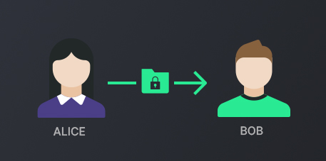

As the highest privacy state requires the most transaction fee, it may not always be the best type of transaction depending on the situation, especially when privacy is not predominantly required by the user.



|                          | Public      | Blind       | Anon        |
|--------------------------|:-----------:|:-----------:|:-----------:|
| [Staking](learn:staking) |  |   |   |
| Privacy                  | ∗           | ∗∗         | ∗∗∗        |
| Hidden TX amount         |   |  |  |
| Anon TX participants     |   |   |  |
| TX fees                  | $           | $$          | $$$         |

| **[Open Marketplace](/learn/market/)**          | Public      | Blind | Anon        |
|-------------------------------------------------|:-----------:|:-----:|:-----------:|
| Paying for Listing fees                         |  | –     | –           |
| [Flagging](/learn/market/governance/) items     |  | –     | –           |
| Purchasing items                                | –           | –     |  |
| Funding [MAD Escrow](/learn/market/mad-escrow/) | –           | –     |  |

**Why has PART different privacy states?**
 
  * Freedom of choice
  * To keep the process of coin minting transparent and have a fully auditable supply. If a bug or exploit were to occur at the staking level, it would be instantly detected whereas with a 100% private chain, it could go unnoticed for an extended period of time
  * To raise the probability and lower the technical barrier to get adopted by third-party services (easier to integrate)
  * As fees are higher for privacy transactions, some users might not want to execute private transactions if they do not require it

## Transaction types details


**Did you know?**\
Particl is the first coin in history to deploy both CT (Blind) and RingCT (Anon) technology on a Bitcoin codebase as well as on top of Segwit.




### Public

**This type of transaction is pseudo-anonymous, just like Bitcoin.**

Public transactions are publicly auditable on any [Particl block explorer](https://explorer.particl.io) and offer the least amount of privacy. They are the cheapest transactions to execute and is the default privacy setting.

<--->

### Blind (CT)

This type of transaction uses the **[Confidential Transactions (CT)](https://elementsproject.org/elements/confidential-transactions/)** privacy protocol developed by Bitcoin Core developer Gregory Maxwell to keep the transferring amounts visible only to the transaction participants (and those they designate), while still guaranteeing the transaction’s cryptographic integrity.

**This is a mid-level privacy option** and is more expensive than public transactions, but cheaper than anon transactions. Mathematical and cryptographic details related to the CT privacy protocol are available on [Maxwell’s original investigation](https://elementsproject.org/elements/confidential-transactions/investigation.html) into the protocol.

<--->

### Anon (RingCT)

This type of transaction uses the **RingCT** privacy protocol developed by Shen Noether to hide both transferring amounts and participants’ blockchain identity by combining [Cryptonote’s ring signatures](https://cryptonote.org/inside) and Maxwell’s CT protocols. It is the one of the highest level of trustless privacy protocol the crypto industry has to offer and was made famous by Monero.

**It is also the most expensive privacy setting to use.**

Mathematical and cryptographic details related to the RingCT privacy protocol are available on [Shen Noether’s RingCT whitepaper](https://eprint.iacr.org/2015/1098.pdf).

